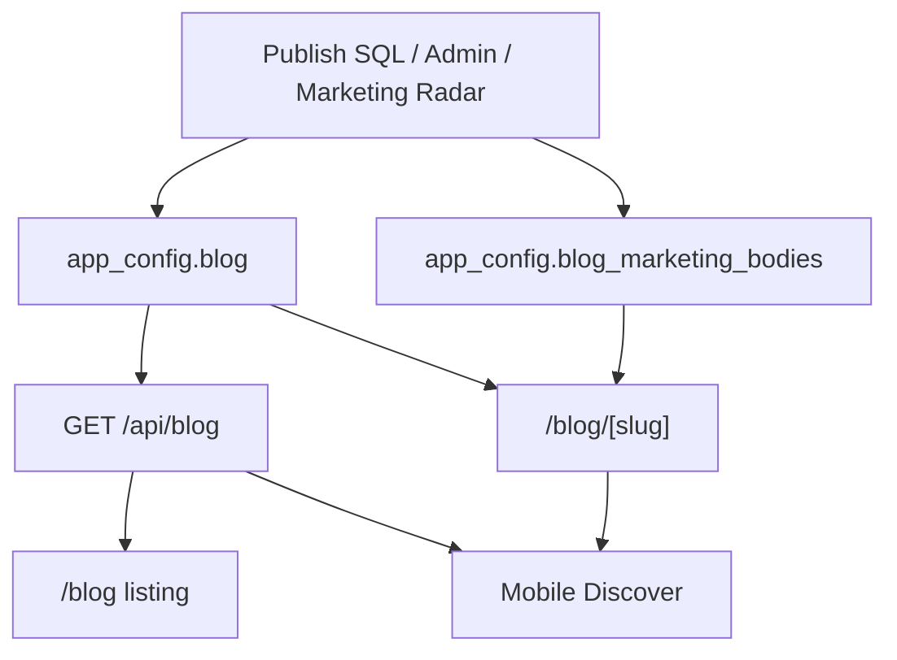

# Blog: sources of truth audit

**Updated:** SQL-first publishing (2026-06). New posts should live in Supabase, not require deploys.

---

## Where blog data lives

| Purpose | Primary source | Fallback | Used by |
|--------|----------------|----------|---------|
| **Listing (cards)** | `app_config.blog` → `entries` | `lib/blog-defaults.ts` | `/blog`, `GET /api/blog`, mobile Discover |
| **Article body** | `app_config.blog_marketing_bodies` → `{ slug: markdown }` | `blogContent` in `app/blog/[slug]/page.tsx` | `/blog/[slug]` via `getDbBlogPost()` |
| **Sitemap slugs** | DB listing + defaults (union) | — | `app/sitemap.ts` |

Shared write path: `lib/blog/publishBlogPost.ts` (Admin Blog, Marketing Radar, SQL generator).

---

## Intended flow (current)

1. **New posts:** Write **both** `blog` and `blog_marketing_bodies`. No code deploy required (after one-time frontend deploy of the dynamic reader).

2. **Website listing:** Merges `DEFAULT_BLOG_POSTS` with API entries; API-only slugs appended; sorted by date.

3. **Article page:** Static `blogContent[slug]` first, else `getDbBlogPost(slug)` from Supabase. ISR `revalidate = 300`.

4. **Mobile:** Lists from API; loads article HTML from website. No `blog-defaults.ts` update needed for SQL-published posts.

5. **Legacy:** Older posts remain in `blog-defaults.ts` / `blogContent` as offline fallback.

---

## Checklist when a post doesn't work

| Symptom | Fix |
|---------|-----|
| Card missing | Add row to `app_config.blog` (or run full publish SQL) |
| Card OK, page 404 | Add markdown to `blog_marketing_bodies[slug]` |
| Stale content after SQL | Wait ~5 min or hard-refresh (ISR) |
| Not in sitemap | Ensure slug in `app_config.blog`; sitemap unions DB + defaults |

---

## Summary

- **New posts:** Supabase is canonical (`blog` + `blog_marketing_bodies`).
- **Code defaults:** Legacy fallback only.
- **Agents:** Use `docs/BLOG_SQL_PUBLISH.md` + `scripts/generate-blog-sql.mjs`.
