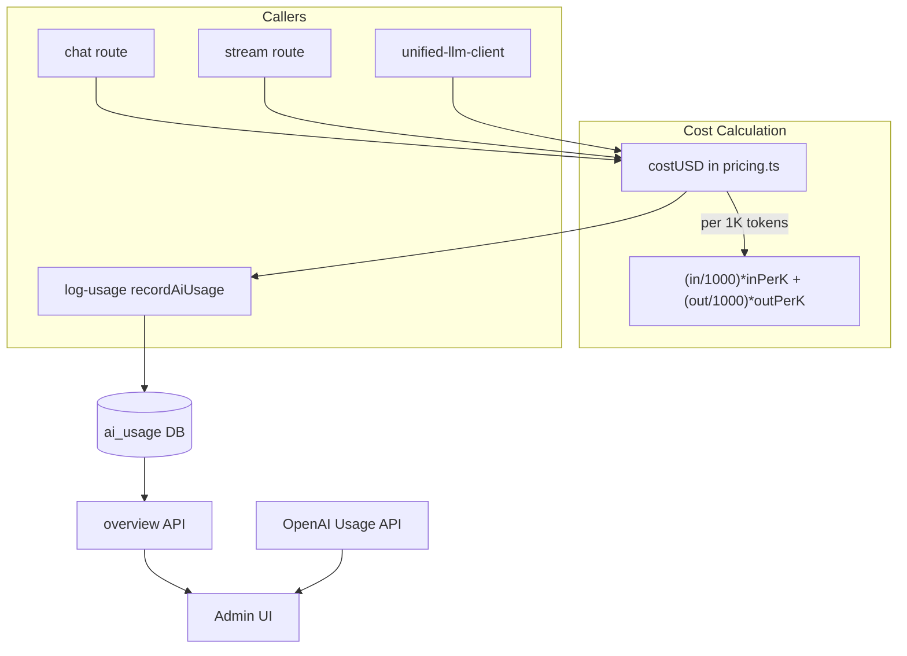

# Cost/Quality Verification Sprint — Full Report

**Sprint overview:** A methodical 3-phase sprint to verify AI cost measurement correctness, detect quality regressions from aggressive cost controls, and produce safe reversible tuning recommendations with panic switches.

**Status:** ✅ Complete (all phases delivered)

---

## Table of Contents

1. [Phase A — Measurement Correctness](#phase-a--measurement-correctness)
2. [Phase B — Quality Audit](#phase-b--quality-audit)
3. [Phase C — Recommendations & Safe Controls](#phase-c--recommendations--safe-controls)
4. [Discoveries & Fixes](#discoveries--fixes)
5. [Commands Reference](#commands-reference)
6. [File Summary](#file-summary)

---

## Phase A — Measurement Correctness

### A1) Cost Math Map

**Source of truth:** `frontend/lib/ai/pricing.ts`

- `costUSD(model, inputTokens, outputTokens)` — single source
- Units: **per-1K tokens** (`inPerK`, `outPerK`). Comment: "$2.50/1M = $0.0025/1K"
- Formula: `(inputTokens/1000)*inPerK + (outputTokens/1000)*outPerK`
- Rounding: 6 dp via `Math.round(cost * 1000000) / 1000000`

**Callers (all use same units):**

| File | Usage |
|------|-------|
| `frontend/lib/ai/log-usage.ts` | Uses passed `cost_usd` if valid, else `costUSD(...)` |
| `frontend/lib/ai/unified-llm-client.ts` | Computes via `costUSD`, passes to `recordAiUsage` |
| `frontend/app/api/chat/route.ts` | `costUSD` for main + planner |
| `frontend/app/api/chat/stream/route.ts` | `costUSD` for stream completion |
| `frontend/app/api/deck/analyze/route.ts` | `recordAiUsage` with `cost_usd: 0` for NO_LLM |

**UI display:** `frontend/app/admin/ai-usage/page.tsx`

- All cost displays use `cost_usd` directly with `toFixed(4)` — no extra scaling
- Overview API sums `cost_usd` + `planner_cost_usd` — same units
- OpenAI actual: `frontend/app/api/admin/ai/openai-usage/route.ts` returns `amount.value` (USD) — same unit

**Double-recording check:** Chat uses `skipRecordAiUsage: true` so route records one row; unified-llm-client does not record when skip=true. Planner call uses `skipRecordAiUsage: true`; main completion records with `planner_cost_usd`.

---

### A2) Golden Unit Tests for pricing.ts

**File:** `frontend/tests/unit/pricing.test.ts`

**Tests implemented:**

- gpt-4o: (100,100), (1000,0), (0,1000), (1234,5678) — exact or epsilon
- gpt-4o-mini: same token pairs
- Anti-regression: (1000,1000) gpt-4o-mini must NOT be 100× higher (catches 1K/1M flip)
- Unknown model: uses default rates, returns reasonable number
- PRICING_VERSION exists
- gpt-5 / gpt-5.2-codex model matching (uses `includes`)

**Run:** `npx tsx tests/unit/pricing.test.ts` or `npm run test:unit`

---

### A3) DB Audit Script

**File:** `frontend/scripts/audit-ai-usage-cost.mjs`

**Logic:**

1. Uses Supabase client to select 50 recent `ai_usage` rows
2. For each row: recomputes `expectedCost = costUSD(model, input_tokens, output_tokens)` (+ planner_cost_usd if used_two_stage)
3. Compares to stored `cost_usd` (and planner_cost_usd)
4. Mismatch if `|stored - expected| > 1e-6` AND `> 1%` relative
5. Prints: mismatch count, by model, by route; sample mismatches with row id

**Run:** `node scripts/audit-ai-usage-cost.mjs` (from `frontend/`)

**Requires:** `NEXT_PUBLIC_SUPABASE_URL`, `SUPABASE_SERVICE_ROLE_KEY` (or `NEXT_PUBLIC_SUPABASE_ANON_KEY`)

**Sample output format:**

```
=== AI Usage Cost Audit ===

Rows checked: 50
Mismatches: 12

By model: { "gpt-4o-mini": 10, "gpt-4o": 2 }
By route: { "chat_stream": 8, "deck_analyze": 4 }

Sample mismatches (first 10):
  <id> | chat_stream | gpt-4o-mini | stored=0.075 expected=0.00075 diff=0.07425 (9900.00%)
```

**Discovery:** Initial run found ~50 mismatches — historical 100× bug (likely 1K/1M unit flip in older code). New data should be correct.

---

### A4) UI Verification

- Admin UI displays `cost_usd` as USD directly (no ÷100, no cents scaling)
- **Dev banner added:** In usage detail modal, when `NODE_ENV === "development"`, shows `(raw: <cost_usd>)` next to displayed value for debugging

---

## Phase B — Quality Audit

### B1) Value-Moment Routes

| Route | Critical (value moment) | Can be cheap |
|-------|------------------------|--------------|
| deck_analyze, deck_analyze_slot_* | Yes | No |
| swap_suggestions, swap_why | Yes | No |
| suggestion_why | Yes | No |
| deck_scan (health-suggestions) | Yes | No |
| deck_compare | Yes | No |
| chat_stream, chat | Mixed | Greetings, simple definitions |
| reprint_risk | Medium | — |
| debug_ping | No | Yes |

**Cheap-safe:** greetings, "what is trample", static FAQ, off-topic.

---

### B2) Layer0 + Tier Routing

**Layer0:** `frontend/lib/ai/layer0-gate.ts`

- MINI_CEILING_TIGHT=128, MINI_CEILING_NORMAL=192
- Routes: chat, chat_stream, deck_analyze
- Misroute risks: "analyze my deck" with no deck → NO_LLM (correct); "best commander for zombies?" → MINI_ONLY (may under-answer complex follow-ups)

**Prompt tier:** `frontend/lib/ai/prompt-tier.ts`

- micro: greeting, simple_definition (isSimpleRulesOrTerm)
- standard: default (best budget ramp, help with cuts)
- full: deck_context, explicit_list_request, deck_intent_no_context, multi_step_or_detailed

**Token ceilings:** `frontend/lib/ai/chat-generation-config.ts`

- BASE_SIMPLE=192, BASE_COMPLEX=320, CAP_NON_STREAM=512
- STREAM_BASE_SIMPLE=768, STREAM_BASE_COMPLEX=**1800** (tuned from 1536), CAP_STREAM=2000

---

### B3) Quality Sentinel Report

**File:** `frontend/scripts/quality-sentinel.mjs`

**Metrics computed (last N days):**

- Per route: retries (same user+route within 2 min), response_truncated rate, 429_budget rate, avg output_tokens, NO_LLM/MINI_ONLY/FULL_LLM %, cache_hit rate, p95 latency
- Per prompt_tier: requests, avg output tokens, truncation rate

**Run:** `node scripts/quality-sentinel.mjs [days]` (default 7, max 90)

**Requires:** `NEXT_PUBLIC_SUPABASE_URL`, `SUPABASE_SERVICE_ROLE_KEY`

**Sample output:**

```
=== Quality Sentinel (last 7 days) ===

Total requests: 342

--- By route ---
route                         req  avgOut  NO_LLM%   MINI%   FULL%  cache%  trunc%   429%   p95ms   retry
chat_stream                   180     420     12.2    45.0    42.8    8.3    2.1    0.0     2100       3
deck_analyze                   45     580      0.0     0.0   100.0    0.0    0.0    0.0     3200       0
...
```

---

### B4) Truth Set Replay

**Files:**

- `frontend/lib/data/quality-sentinel-prompts.json` — 21 prompts (greetings, simple defs, deck analysis, list requests, Layer0 cases)
- `frontend/scripts/replay-tier-classification.mjs` — runs each through `classifyPromptTier` + `layer0Decide` (no OpenAI call)

**Run:** `npx tsx scripts/replay-tier-classification.mjs`

**Assertions:** "analyze my deck" + deck → full; "what is trample" → micro; "give me 10 swaps" → full; Layer0 cases (NO_LLM, MINI_ONLY, FULL_LLM) by reason.

---

## Phase C — Recommendations & Safe Controls

### C1) Panic Switches

**Existing:** `llm_force_mini_only`, `llm_disable_stream` in app_config

**Implemented:**

| Switch | Type | Purpose |
|--------|------|---------|
| `llm_force_full_routes` | `string[]` | Bypass Layer0 MINI/NO_LLM for these routes (e.g. `["deck_analyze","swap_suggestions"]`) |
| `llm_min_tokens_per_route` | `Record<string, number>` | Min max_tokens per route (e.g. `{ "deck_analyze": 256, "chat": 256 }`) |

**Storage:** `app_config` table; keys `llm_force_full_routes`, `llm_min_tokens_per_route`

**Wiring:** `frontend/lib/ai/runtime-config.ts`, chat route, chat stream route, deck analyze route

---

### C2) Tuning Changes Implemented

| # | Change | File | Logic | Benefit | Revert |
|---|--------|------|-------|---------|--------|
| 1 | deck_analyze min tokens | `app/api/deck/analyze/route.ts` | `DECK_ANALYZE_MIN_TOKENS = 256`; `maxTokens = Math.max(maxTokens, DECK_ANALYZE_MIN_TOKENS)` | Avoid under-answering | Remove floor |
| 2 | Deck-intent never micro | `prompt-tier.ts` | If `isDeckAnalysisRequest(text)` → full (even without deck) | No micro for "analyze my deck" | Revert condition |
| 3 | STREAM_BASE_COMPLEX | `chat-generation-config.ts` | 1536 → 1800 | More complete stream answers | Revert constant |
| 4 | Multi-step heuristic | `prompt-tier.ts` | If "step by step" / "detailed" / "in detail" / "break down" / "walk me through" → full | Better for complex asks | Revert pattern |
| 5 | response_truncated UX | — | Deferred (already logged) | — | — |
| 6 | simple_one_liner length | `layer0-gate.ts` | 65 → 80 chars for MINI_ONLY | Fewer borderline FULL→MINI | Revert constant |
| 7 | minTokenFloor in getDynamicTokenCeiling | `chat-generation-config.ts` | `minTokenFloor` param; route passes from `llm_min_tokens_per_route` | Safety net for value-moment routes | Remove param |

---

## Discoveries & Fixes

### 1. Historical Cost Bug (100×)

**Discovery:** Audit script found ~50 mismatches where stored cost was ~100× higher than recomputed. Likely historical 1K/1M unit flip. New data (post-pricing fix) should be correct.

**Action:** No code change; audit script confirms current logic. Historical rows retain old values.

---

### 2. MTG Scope Keywords — Off-Topic Misclassification

**Discovery:** "suggest improvements" with deck context was returning `NO_LLM` (off_topic) instead of `FULL_LLM`. Cause: `hasNoMTGKeyword` returned true because "suggest" and "improve" were not in `MTG_SCOPE_KEYWORDS`.

**Fix:** Added `suggest`, `improve` to `MTG_SCOPE_KEYWORDS` in `layer0-gate.ts`.

---

### 3. Simple Rules Terms — Off-Topic Misclassification

**Discovery:** "what is vigilance?" was returning `NO_LLM` (off_topic) instead of `MINI_ONLY`. Cause: "vigilance" was not in `MTG_SCOPE_KEYWORDS`, so `isClearlyNonMTG` fired before `isSimpleRulesOrTerm`.

**Fix:** Added `vigilance`, `first strike`, `double strike` to `MTG_SCOPE_KEYWORDS` in `layer0-gate.ts`.

---

### 4. defaultLong Test — Threshold Change

**Discovery:** After tuning (simple_one_liner 65→80 chars), the test string "Explain in detail the history of Magic the Gathering and its impact on card games." (75 chars) hit `simple_one_liner` and returned `MINI_ONLY` instead of `FULL_LLM` (default).

**Fix:** Extended test string to 86 chars: "...card games worldwide." so it exceeds 80 and hits `default` path.

---

### 5. Duplicate Import

**Discovery:** `layer0-gate.test.ts` had duplicate `import { getFaqAnswer } from "@/lib/ai/static-faq"`.

**Fix:** Removed duplicate.

---

## Commands Reference

| Command | Purpose |
|---------|---------|
| `npm run test:unit` | Run all unit tests (canonicalize, openai-params, layer0-gate, pricing) |
| `npx tsx tests/unit/pricing.test.ts` | Pricing golden tests only |
| `node scripts/audit-ai-usage-cost.mjs` | Cost consistency audit (50 recent rows) |
| `node scripts/quality-sentinel.mjs [days]` | Quality metrics by route/tier |
| `npx tsx scripts/replay-tier-classification.mjs` | Tier + Layer0 classification replay |

**Environment:** Scripts load `.env.local` from project root. Audit and Quality Sentinel require Supabase credentials.

---

## File Summary

| Artifact | Path |
|----------|------|
| Pricing unit tests | `frontend/tests/unit/pricing.test.ts` |
| Audit script | `frontend/scripts/audit-ai-usage-cost.mjs` |
| Quality Sentinel | `frontend/scripts/quality-sentinel.mjs` |
| Truth set prompts | `frontend/lib/data/quality-sentinel-prompts.json` |
| Tier replay script | `frontend/scripts/replay-tier-classification.mjs` |
| Runtime config (panic switches) | `frontend/lib/ai/runtime-config.ts` |
| Prompt tier (deck-intent, multi-step) | `frontend/lib/ai/prompt-tier.ts` |
| Layer0 gate (keywords, simple_one_liner) | `frontend/lib/ai/layer0-gate.ts` |
| Chat generation (STREAM_BASE_COMPLEX, minTokenFloor) | `frontend/lib/ai/chat-generation-config.ts` |
| Deck analyze (DECK_ANALYZE_MIN_TOKENS) | `frontend/app/api/deck/analyze/route.ts` |
| Admin UI (dev banner) | `frontend/app/admin/ai-usage/page.tsx` |

---

## Cost Flow Diagram



---

## Related Docs

- `docs/AI_USAGE_HANDOVER.md` — AI usage system, routes, schema
- `docs/AI_USAGE_ADMIN.md` — Config switches, safe operating playbook
