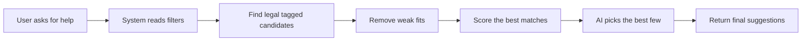

# AI Recommender ELI5 Report

Last updated: 2026-05-16

## What Changed

The recommender is now much less random.

Before:

- it could over-trust broad tags
- AI could make weak taste decisions from messy candidate lists
- some routes were more “generic good cards” than “good cards for this deck or player”

Now:

- the system first finds a cleaner shortlist
- it filters out bad fits earlier
- then AI chooses from that shortlist instead of guessing from the whole game

## Simple Version Of How It Works

1. The system reads what the user wants
   - format
   - theme
   - budget
   - power level
   - role like draw, interaction, finisher

2. It searches the tagged card database for legal matches

3. It removes weak or off-theme options

4. It scores the remaining cards or commanders

5. AI picks the best few from that approved list and writes the short explanation

6. If AI acts weird or fails, the system falls back to the normal scored list

## Guest / Free / Pro

The recommender is tiered now:

- Guest gets the lightest model
- Free gets a better model
- Pro gets the strongest model

That means Pro gets better reranking and usually better reasons too.

## Where This Helps

It now improves the recommendation brain behind:

- commander suggestions
- recommended cards
- deck-specific recommendations
- health suggestions
- budget swaps
- finish-the-deck suggestions

## What It Is Good At Now

- sticking to legality rules
- respecting deck themes better
- handling budget/power/format inputs better
- keeping AI from inventing random suggestions

## What Still Needs Future Tuning

- some niche commanders can still feel a little “technically right but not perfect”
- some routes still need even richer tags to feel fully premium
- the system is strong now, but there is still room to make it more taste-aware

## Tiny Flow Chart

## Bottom Line

The system is now a lot more solid because AI is no longer guessing from scratch.

It is using:

- real tags
- real legality checks
- real request filters
- and a safer shortlist-first process

That is the big quality jump.

## Extra Confidence Check

There is now a bigger local benchmark too.

- 52 explicit recommendation checks
- real deck data
- different routes and filters
- current result: `52 / 52 passed`
