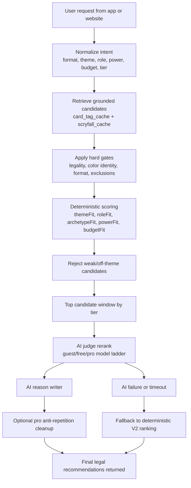

# AI Recommender Technical Report

Last updated: 2026-05-16

## Summary

The recommender system now uses a two-stage pipeline:

1. `V2 deterministic grounding`
   - build intent from request context
   - retrieve legal candidates from `card_tag_cache` + `scryfall_cache`
   - score by theme, role, archetype, power, budget, format, and diversity
   - reject weak or off-theme candidates before AI sees them

2. `V3 AI reranking`
   - AI only reranks prevalidated grounded candidates
   - AI never invents new cards or commanders
   - deterministic fallback is always available if AI fails or drifts

This keeps legality and filter adherence deterministic, while using AI for taste, prioritization, and better reasons.

## Main Files

- `C:\Users\davy_\Projects\mtg_ai_assistant\frontend\lib\recommendations\recommendation-tier.ts`
- `C:\Users\davy_\Projects\mtg_ai_assistant\frontend\lib\recommendations\recommendation-pipeline.ts`
- `C:\Users\davy_\Projects\mtg_ai_assistant\frontend\lib\recommendations\tag-grounding.ts`
- `C:\Users\davy_\Projects\mtg_ai_assistant\frontend\lib\recommendations\commander-recommender.ts`

## Tiering

Recommender-specific model ladder:

- Guest: `gpt-5.4-mini`
- Free: `gpt-5.4`
- Pro: `gpt-5.5`

Tier differences:

- Guest uses the smallest candidate window and a single AI judge pass
- Free uses a medium candidate window and two AI passes
- Pro uses the largest candidate window, two AI passes, and stricter anti-repetition behavior

## Request Inputs Supported

The pipeline now respects these filter types when present:

- format
- commander color identity
- budget band
- power band
- quiz theme
- gameplay role
- archetype
- category intent such as `interaction`, `card_draw`, `win_condition`
- exclusion lists like cards already in the deck

## Grounding Data

Primary grounding source:

- `card_tag_cache`

Joined supporting source:

- `scryfall_cache`

Examples of grounded tag families:

- themes: `tokens`, `graveyard`, `artifacts`, `enchantments`, `spellslinger`, `blink`, `tribal`
- gameplay: `ramp`, `card_draw`, `interaction`, `recursion`, `finisher`, `engine`, `payoff`
- commander-specific: `go_wide`, `aristocrats`, `spell_combo`, `tribal_commander`

## Route Coverage

The shared grounded pipeline now feeds:

- `/api/mobile/commander-recommendations`
- `/api/recommendations/cards`
- `/api/recommendations/deck/[id]`
- `/api/deck/health-suggestions`
- `/api/deck/swap-suggestions`
- `/api/deck/finish-suggestions`

## Flow Chart

## Testing Done

Local validation used:

- `npx tsc --noEmit`
- `npm run test:unit`
- `npm run build`
- `npx tsx scripts/verify-recommendation-local.ts`
- `npm run benchmark:recommendations`

The local verifier covers:

- commander scenarios across guest/free/pro
- shared route checks for `cards`, `deck`, `health`, `swap`, and `finish`
- real local Supabase-backed candidate retrieval

The benchmark suite adds:

- 52 explicit benchmark cases
- grouped coverage for `commander`, `cards`, `deck`, `swap`, `finish`, and category-focused checks
- real public deck samples from Supabase
- pass/fail summary output by benchmark group

Current benchmark status:

- `52 / 52 passed`

## Current Strengths

- legality remains server-side and deterministic
- tiering is explicit and testable
- AI is constrained to approved candidates only
- category routes now retrieve by role intent, not just deck theme
- commander recommendations are harder to pollute with false positives from weak theme matches

## Known Soft Spots

- some recommendation taste still depends on broad tag quality
- unusual commanders can still surface when their tags overlap strongly with the request
- shared route verification is strong, but quality can still improve with more benchmark fixtures and more curated negative cases

## Recommended Next Improvements

1. Expand benchmark fixtures with more real public deck archetypes
2. Add stronger negative blacklists for known embarrassing picks by theme
3. Enrich tags further for role precision:
   - `token_maker`
   - `token_payoff`
   - `spell_payoff`
   - `creature_cost_reduction`
   - `graveyard_payoff`
   - `graveyard_enabler`
4. Add route-specific score weighting for `swap` and `finish`
5. Persist benchmark snapshots so future changes can be compared before deploy
