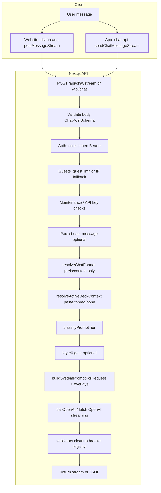
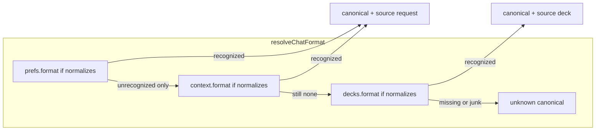
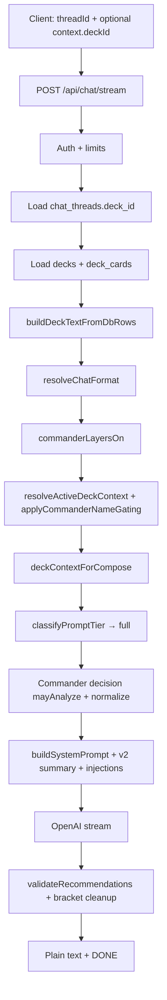

# AI Chat System Flow (ManaTap)

Internal reference for how chat requests move from clients through Next.js routes to OpenAI (and back). Paths are relative to the website repo `**frontend/**` unless noted.

---

## 1. High-Level Overview

### General chat vs deck-linked chat

| Mode                 | Meaning                                                                                                                                                                                                                             |
| -------------------- | ----------------------------------------------------------------------------------------------------------------------------------------------------------------------------------------------------------------------------------- |
| **General chat**     | No linked deck attached to the request/thread (or explicit user override clearing deck context). The model answers rules, cards, theory, generic deckbuilding questions without a persisted deck list from `deck_cards`.            |
| **Deck-linked chat** | The thread (or request `context.deckId`) points at a row in `decks`; the API loads `decks` + `deck_cards` (and often a v2 deck summary). Prompts can include deck lists, commander metadata, format, and analysis-oriented modules. |

### Streaming vs non-streaming

| Route                       | Response shape                                                                                                                                       | Primary clients                                                                                                                                                                        |
| --------------------------- | ---------------------------------------------------------------------------------------------------------------------------------------------------- | -------------------------------------------------------------------------------------------------------------------------------------------------------------------------------------- |
| `**POST /api/chat/stream`** | `**text/plain**` stream of tokens, ends with `[DONE]`; errors may be **JSON** with `Content-Type: application/json` (rate limits, maintenance, etc.) | **Manatap mobile app** (`sendChatMessageStream` → same host + `/api/chat/stream`). **Website** main chat UI via `lib/threads.ts` → `postMessageStream` / `postMessageStreamWithDebug`. |
| `**POST /api/chat`**        | **JSON** envelope (`ok`, `text`, `threadId`, …) after full generation                                                                                | **Legacy / utility** calls: e.g. `ChatSendHotfix`, some admin flows, `TopMovers`, cost-to-finish snippets, tests that wait on `/api/chat`.                                             |

**Important:** Mobile deck chat and home chat use `**/api/chat/stream`**, not `/api/chat`. Do not assume “deck chat = non-stream.”

Shared concepts on both routes:

- Same broad **auth order**: cookie Supabase session first, then **Bearer** JWT if no cookie user (mobile).
- Guest limits: `**X-Guest-Session-Token`** or cookie token → `guest_sessions`; if no token, **IP-hash** fallback (rate-limit key differs by route path in durable limiter: `/api/chat` vs `/api/chat/stream`).
- **Prompt tiers** (`micro` / `standard` / `full`) from `lib/ai/prompt-tier.ts`: any **deck compose context** forces **full** tier.
- **Format resolution** for gating vs **FORMAT_*** layers: `lib/chat/resolve-chat-format.ts`.

---

## 2. General Chat Flow (No Deck)

### Preconditions

- `thread.deck_id` is null **and** request body does not supply `context.deckId`, **or** the user has no linked deck fetched (same outcome: no `deckData` from DB).
- User may still paste a decklist in the message (`current_paste` / `guest_ephemeral` / `thread_slot` paths inside `resolveActiveDeckContext`) — that is **ephemeral/thread** deck context, not “linked deck chat” in the product sense below, but tier may still go **full** if parsed entries exist.

### Flow diagram (conceptual sequence)

### Step-by-step (aligned with `**/api/chat/stream**`; `**/api/chat**` parallels with differences noted)

1. **Request body**
  - `text` (or legacy `prompt`) — required.  
  - `threadId` optional UUID (`ChatPostSchema`).  
  - `**messages`** — optional guest multi-turn (`/api/chat/stream`); website guests may pass prior turns here.  
  - `**prefs` / `preferences**`, `**context**` (`deckId`, `budget`, `colors`, optional `forceTier`, future `format`) — forwarded when present.  
  - `**sourcePage` / `source_page**`, `**chat_source**` — analytics / usage attribution.
2. **Auth** (`stream/route.ts` comments: fixed precedence)
  - `getServerSupabase()` + `getUser()` from cookies.  
  - If no user: `Authorization: Bearer <jwt>` → `createClientWithBearerToken` + `getUser(bearerToken)`.
3. **Guest rate limits**
  - **Stream:** `getGuestToken` → `checkGuestMessageLimit`; else **IP** durable limit on route `**/api/chat`**.  
  - **Non-stream:** same pattern; route key for durable limits is `**/api/chat`**.
4. **Authenticated rate limits**
  - Durable daily cap (Pro vs free) per route; **non-stream** also enforces per-minute + in-memory burst for users.
5. **Thread + DB pre-write (stream)**
  - If `threadId` + logged-in user: insert user row into `chat_messages` early (before RAG/history reads).
6. **Linked deck fetch**
  - For **general** chat: `deckIdLinked` from thread + `context.deckId` is typically **absent** → no `decks` / `deck_cards` load → `deckData === null`.
7. `**resolveChatFormat`**
  - Inputs: `prefs.format`, `context.format`, `deckData?.d?.format` (null here).  
  - Output: `canonical`, `source` (`request` | `deck` | `unknown`).  
  - **Gating flag:** `commanderLayersOn = chatFormatUsesCommanderLayers(canonical)` — **false** when canonical is null or non-commander.
8. `**resolveActiveDeckContext`** (`lib/chat/active-deck-context.ts`)
  - Without linked `deckData`, resolution uses **paste**, **thread slot**, **guest history**, or **none**.  
  - `**applyCommanderNameGating`:** `commanderLayersOn` from stream/route (omit on older callers ⇒ defaults to Commander-style gating in resolver).
9. `**classifyPromptTier`**
  - No deck compose cards from DB → typically **standard** or **micro** depending on greeting/simple rules / rules questions; deck-intent phrasing forces **full** even without deck.
10. `**buildSystemPromptForRequest`** (`lib/ai/prompt-path.ts`)
  - `**formatKey**` = `formatKeyForPromptLayers(canonical)` ⇒ **unknown ⇒ `"commander"`** for FORMAT_* layers (legacy stack).
11. **Layer 0 (optional)**
  - `LLM_LAYER0` runtime: may return canned text without OpenAI (**NO_LLM**), or **MINI_ONLY** model — stream and non-stream both have analogous gates (`layer0Decide`).  
    - Stream skips layer0 when commander flow awaits confirmation (`skipLayer0ForCommanderFlow`).
12. **OpenAI**
  - Stream: chunked SSE-style read of `**/v1/chat/completions*`* with `stream: true`; heartbeat / max duration guarded in route.  
    - Non-stream: `callOpenAI` / `callLLM` single response.
13. **Post-processing**
  - Trim outros, `**validateRecommendations`** when deck cards known, bracket enforcement, `**stripIllegalBracketCardTokensFromText**` in some branches.  
    - Non-stream: `**enforceChatGuards**` may prepend “assume Commander” when no deck context (website-only UX).

---

## 3. Deck-Linked Chat Flow

### How a thread becomes deck-linked

- **Website:** User links a deck to a thread (e.g. deck page / `DeckAssistant` / thread toolbar) → `chat_threads.deck_id` set (see `/api/chat/threads/link`, `/link-deck`).
- **App:** Thread row created or reused with `**deck_id`** matching the deck; `**POST /api/chat/stream**` sends `context: { deckId }` **and/or** relies on `**thread.deck_id`** resolved server-side from `chat_threads`.

### Server-side deck load (**both** routes, when `deckId` resolved)

Rough order (**stream** implementation; **route** parallels):

1. Read `**chat_threads`** for `deck_id` when `threadId` present + merge `**context.deckId**` override.
2. `**decks**`: `title`, `**commander**`, `**format**`, optionally `deck_aim`, `colors`.
3. `**deck_cards**`: `name`, `**qty**`, `**zone**` (linked path builds text via `**buildDeckTextFromDbRows**` — mainboard block + optional `**Sideboard**` section).
4. Build `**deckData**`: `{ d, entries, deckText }` for downstream inference and prompts.

### Format + commander resolution (deck-linked)

- `**chatFormatUsesCommanderLayers(canonical)**` — **true** only when canonical is `**commander`**. Drives Commander-specific confirmations, grounding, rules spine, prefs color-identity wording, `**streamContractInjection**` “COMMANDER CONFIRMED” variant, `**applyCommanderNameGating**` in `**resolveActiveDeckContext**`.
- `**formatKeyForPromptLayers(canonical)**` — `**canonical ?? "commander"**` so **FORMAT_*** composed prompts stay Commander-flavored when format is unknown (intentional product default for modules **not** for gating).

### Full-tier “may analyze” (stream deck path)

After `**deckContextForCompose`** exists and tier is **full**:

- `**commanderLayersOn`**:
  - **true:** `**mayAnalyze`** requires `**commanderName**` and authoritative/confirmed semantics (linked trusted via `isAuthoritativeForPrompt`, paste path requires confirmation flags).
  - **false** (Modern / Pauper / unknown canonical, etc.): `**mayAnalyze`** can be true via `**linkedWithDeckCards**` (linked + compose cards), paste, thread-backed deck, or `authForPrompt` — **does not require commander**.
- `**normalizeCommanderDecisionState`** receives `**analyzeAllowedWithoutNamedCommander: !commanderLayersOn**` to avoid RULE B paste downgrades wrongly blocking constructed-linked analysis.

Non-stream `**/api/chat**` does not use the identical `streamInjected` / contract injection strings, but uses the same `**resolveChatFormat**`, `**commanderLayersOn**`-gated blocks (grounding, COMMANDER UNKNOWN paste block, inferred deck section, etc.) where implemented in `app/api/chat/route.ts`.

### Flow diagram (deck-linked, stream)

---

## 4. Streaming vs Non-Streaming (Detail)

| Concern                            | `/api/chat/stream`                                                                         | `/api/chat`                                                           |
| ---------------------------------- | ------------------------------------------------------------------------------------------ | --------------------------------------------------------------------- |
| **Typical UI**                     | Website chat (`lib/threads.ts`), **all primary app chat**                                  | Hotfix, tools, tests, some one-shot JSON consumers                    |
| **First-class deck analysis path** | Yes: `streamInjected`, admin prompt preview header, longer token ceiling when deck context | Yes: v2 summary, inference, multi-stage “lite” agent option in places |
| **Guest `messages[]`**             | Supported in schema                                                                        | Not the same shape in `ChatPostSchema` (thread-only + server history) |
| **Rate limit DB key suffix**       | `...'/api/chat/stream'`                                                                    | `...'/api/chat'`                                                      |
| **Output**                         | Incremental plaintext                                                                      | Single JSON                                                           |

---

## 5. Key Source Files

| Responsibility                       | Location                                                                                |
| ------------------------------------ | --------------------------------------------------------------------------------------- |
| Stream handler                       | `app/api/chat/stream/route.ts`                                                          |
| Non-stream handler                   | `app/api/chat/route.ts`                                                                 |
| Format resolution (gating vs layers) | `lib/chat/resolve-chat-format.ts`                                                       |
| Deck/commander state machine         | `lib/chat/active-deck-context.ts`                                                       |
| Paste/thread analyze invariants      | `lib/chat/normalize-commander-decision.ts`                                              |
| Tier classification                  | `lib/ai/prompt-tier.ts`                                                                 |
| Composed prompts                     | `lib/ai/prompt-path.ts` (+ DB prompt versions / admin)                                  |
| Website streaming client             | `lib/threads.ts` (`postMessageStream`, debug variant)                                   |
| Thread memory injection              | `lib/chat/chat-context-builder.ts` (`injectThreadSummaryContext`, Pro prefs)            |
| Layer 0 routing                      | `lib/ai/layer0-gate.ts`                                                                 |
| Mobile client (outside this repo)    | `Manatap-APP/src/lib/chat-api.ts` → `**EXPO_PUBLIC_API_BASE_URL`** + `/api/chat/stream` |

---

## 6. Invariants Engineers Should Remember

1. `**resolveChatFormat` order:** recognized **prefs** → recognized **context** → **deck**; unparseable prefs alone **never** hides a valid `**decks.format`**.
2. **Unknown canonical:** Commander **FORMAT_*** compose default (`formatKey`), but **commanderLayersOn === false** — no `**need_commander`** hard gate from `**applyCommanderNameGating**`.
3. **Brawl / other strings** not handled by `**normalizeDeckFormat`** today → canonical `**null**` → treated like unknown for Commander **gating** (Phase 3 can map formats explicitly).
4. **Website** deck linking persists on `**chat_threads.deck_id`**; **mobile** sends `**deckId` in context** when applicable; server merges with thread.

---

*Last updated to reflect format-aware chat resolution (`resolveChatFormat`, `chatFormatUsesCommanderLayers`, `buildDeckTextFromDbRows` on linked loads).*