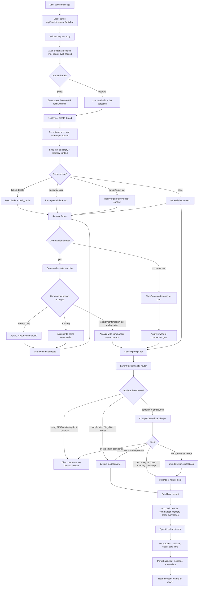

# ManaTap Chat Pipeline

Technical reference for LLM agents and engineers working on ManaTap chat.

Repo root for this document: `C:\Users\davy_\Projects\mtg_ai_assistant\frontend`.

Primary rule: main chat, website deck chat, and mobile chat all flow through the same backend pipeline. Do not fix one surface by assuming a different server contract unless the client code proves it.

---

## 1. Primary Entry Points

| Surface | Client file | API route | Notes |
| --- | --- | --- | --- |
| Website main chat | `components/Chat.tsx`, `lib/threads.ts` | `POST /api/chat/stream` | Streaming plaintext response ending in `[DONE]`. |
| Website deck chat | `app/my-decks/[id]/DeckAssistant.tsx` | `POST /api/chat/stream` | Same backend stream route, but usually sends or persists `deckId`. |
| Mobile main/deck chat | `Manatap-APP/src/lib/chat-api.ts` | `POST /api/chat/stream` | Mobile should treat stream contract as canonical. |
| Legacy / utility callers | Mixed tools/tests/admin helpers | `POST /api/chat` | JSON response, not streaming. Keep behavior compatible, but stream route is primary. |

`/api/chat/stream` and `/api/chat` should share the same semantic decisions wherever possible:

- Auth and guest identity.
- Free/pro/guest limit enforcement.
- Thread persistence.
- Deck context resolution.
- Format and commander gating.
- Layer 0 routing and intent classification.
- Prompt construction.
- Safe fallback behavior.
- Message and usage logging.

---

## 2. High-Level Flow



---

## 3. Request Contract

### Common Body Fields

| Field | Meaning |
| --- | --- |
| `text` / legacy `prompt` | User message. `text` is preferred. |
| `threadId` | Existing chat thread UUID. Optional for guests/new chats. |
| `messages` | Guest multi-turn context, mostly stream route. |
| `context.deckId` | Deck to link/use for this turn. Server must verify ownership. |
| `context.format` | Optional format hint from client. |
| `prefs` / `preferences` | Budget, colors, format, playstyle, force tier, and similar user preferences. |
| `sourcePage`, `source_page`, `chat_source` | Analytics and usage attribution. |
| `evalRunId` / source flags | Used by audit/test suites. Do not treat as auth. |

### Response Shapes

`POST /api/chat/stream`:

- Normally returns `text/plain`.
- Streams response chunks.
- Ends with `[DONE]`.
- May append a metadata block before `[DONE]` depending on caller/debug path.
- Rate-limit/maintenance errors may return JSON instead of plaintext.

`POST /api/chat`:

- Returns JSON envelope such as `{ ok, text, threadId, provider }`.
- Used by fallback and utility paths.
- Must not reintroduce old canned-answer deck bugs.

---

## 4. Auth, Tiering, And Limits

### Auth Order

Routes use server Supabase auth in this order:

1. Cookie session via `getServerSupabase()` / `getUser()`.
2. If no cookie user, `Authorization: Bearer <jwt>` for mobile.
3. If still no user, treat as guest.

Never trust client-supplied `user_id`, tier, pro status, entitlement, model, token limit, or admin status.

### Tier Sources

The route determines user tier server-side:

- Guest: no authenticated user.
- Free: authenticated user without active pro entitlement.
- Pro: authenticated user with active entitlement/subscription.

Tier affects normal model selection, message limits, and usage logging. The OpenAI intent helper is intentionally tier-independent and always uses the lowest configured model.

### Rate Limits

Guest:

- Prefer `X-Guest-Session-Token` or guest cookie.
- Fall back to IP-hash durable limiter when needed.
- Route keys differ for `/api/chat` and `/api/chat/stream`.

Authenticated:

- Durable daily caps by tier.
- Some non-stream paths also use per-minute or in-memory burst checks.

Intent helper:

- Runs after route-level rate-limit checks.
- Uses `MODEL_GUEST` / fallback.
- Sets `skipRecordAiUsage: true`, so it should not consume normal `ai_usage` tier rows.
- Still emits observability/analytics events through the unified LLM client.

---

## 5. Thread Persistence

Relevant tables:

- `chat_threads`
- `chat_messages`
- `ai_usage`
- `user_chat_preferences`
- `deck_memories`

Common behavior:

1. Resolve or create a thread.
2. If logged in and a thread exists, persist the user message before building context where the route needs current history.
3. Load recent thread messages.
4. Build memory and preference context.
5. After response, persist assistant message and usage metadata.

Guest behavior:

- Guests may have ephemeral message history passed by the client.
- Guests can have active deck context recovered from request/history where supported.
- Guest context must not imply durable memory.

---

## 6. Deck Context Resolution

Key files:

- `lib/chat/active-deck-context.ts`
- `lib/chat/decklistDetector.ts`
- `lib/deck/parseDeckText.ts`
- `lib/chat/resolve-chat-format.ts`
- `lib/chat/normalize-commander-decision.ts`
- `lib/chat/enhancements.ts`

Deck context can come from several places.

| Source | Meaning | Persistence |
| --- | --- | --- |
| Linked deck | `thread.deck_id` or `context.deckId` points to `decks` and `deck_cards`. | Durable server-side link. |
| Current paste | User pasted a decklist in the latest message. | Ephemeral unless saved/linked elsewhere. |
| Thread slot | Prior decklist in the same thread. | Thread-local. |
| Guest ephemeral | Guest prior messages contain deck context. | Client/session-local. |
| None | General chat. | No deck context. |

Linked deck load:

1. Resolve `deckId` from request context and/or `chat_threads.deck_id`.
2. Verify user ownership server-side.
3. Load `decks` row: title, commander, format, colors, deck aim.
4. Load `deck_cards`: name, quantity, zone.
5. Build text with mainboard and sideboard separation.
6. Build `deckData` and active deck context for prompt composition.

Pasted decklist parsing:

- Detects common `1 Card Name` lines.
- Preserves mainboard/sideboard sections where possible.
- Cleans user annotations from card names, e.g. `- THIS IS THE COMMANDER`, `(Commander)`, `<-- commander`.
- Commander inference should be conservative. Do not treat the first card as commander unless the context strongly supports it.

---

## 7. Format Resolution

Key file: `lib/chat/resolve-chat-format.ts`.

Resolution order:

1. Recognized `prefs.format`.
2. Recognized `context.format`.
3. Recognized `decks.format`.
4. Unknown/null.

Important distinction:

- `chatFormatUsesCommanderLayers(canonical)` controls commander-specific gates.
- `formatKeyForPromptLayers(canonical)` controls FORMAT_* prompt modules.

Commander gating:

- Only true for canonical Commander.
- Commander-specific prompts and confirmation rules apply.
- Commander color identity and commander legality wording applies.

Non-Commander formats:

- Standard, Modern, Pioneer, Pauper, Legacy, Vintage, and similar constructed formats must not require commander confirmation.
- Brawl/Historic/Explorer/Alchemy support depends on normalization coverage. If not normalized, they may become `unknown`; unknown still must not trigger hard commander gating.
- Sideboards matter more for constructed formats. Preserve mainboard/sideboard separation in prompt context.

Unknown format:

- No commander hard gate.
- Some legacy FORMAT_* prompt layers may default to Commander wording through `formatKeyForPromptLayers(canonical)`.
- Be careful: unknown format is not proof of Commander.

---

## 8. Commander State Machine

Commander confirmation exists to prevent bad Commander deck analysis when the decklist is ambiguous.

It should only run when `commanderLayersOn === true`.

States:

| State | Meaning | Action |
| --- | --- | --- |
| Explicit commander | User says `commander is X`, `the commander is X`, or annotates a card as commander. | Analyze now. |
| Linked authoritative commander | `decks.commander` exists for linked deck. | Analyze now. |
| Confirmed inferred commander | User confirmed a prior inference. | Analyze now. |
| Inferred only | Parser guessed from deck/list but user did not confirm. | Ask `Is X your commander?` |
| Missing | Commander deck but no commander candidate. | Ask user to name commander. |
| Corrected | User says the commander is Y instead. | Update state and loop back into format/deck context. |

Confirmation loop:

1. Route asks a commander question.
2. User confirms or corrects.
3. `skipLayer0ForCommanderFlow` prevents Layer 0 from treating bare card names/yes/no as off-topic.
4. Active deck context updates.
5. The next pass proceeds into normal routing and prompt building.

Non-Commander deck:

- Do not ask for commander.
- Do not block analysis because commander is missing.
- Use deck cards, format, sideboard, and user question directly.

---

## 9. Prompt Tiering

Key file: `lib/ai/prompt-tier.ts`.

Typical tiers:

- `micro`: tiny/simple prompts.
- `standard`: normal general MTG chat.
- `full`: deck analysis, linked deck context, pasted decklist context, multi-step reasoning.

Any real deck compose context should force full prompt tier because the answer needs card-by-card context and validation.

Layer 0 can still route simple standalone questions to the lowest model before the final full prompt is built.

---

## 10. Layer 0 Router And Intent Helper

Key file: `lib/ai/layer0-gate.ts`.

Layer 0 exists before the expensive final answer. It decides whether to answer directly, use a cheap model, or continue into the full model.

### Deterministic Router

`layer0Decide(args)` handles:

- Empty input -> direct ask for message.
- Deck edit command with deck context -> full model.
- User asks to analyze "my/this deck" but no deck context -> direct ask to link/paste deck.
- ManaTap FAQ -> static answer.
- Clearly off-topic no-history -> direct off-topic response.
- Clearly off-topic with history -> off-topic AI check or intent helper.
- Simple rules/term question with no deck -> lowest model.
- Near budget cap for non-pro -> lowest model unless clearly full deck context.
- Pasted decklist or deck analysis -> full model.
- Simple one-liner no deck -> lowest model.
- Default -> full model.

### Cheap OpenAI Intent Helper

`layer0DecideWithIntent(args)` wraps `layer0Decide(args)`.

It calls `classifyChatTurnIntentWithOpenAI(args)` only when helpful:

- Ambiguous/fuzzy message.
- Has deck context.
- Has chat history.
- Deterministic decision is not enough, or would use the old off-topic-history check.

It does not call the model for obvious decklists, empty input, static FAQ, or deterministic direct exits.

Intent labels:

- `deck_analysis`
- `deck_edit_followup`
- `decklist_paste`
- `commander_confirmation`
- `rules_question`
- `legality_question`
- `price_question`
- `format_question`
- `memory_recall`
- `general_mtg`
- `faq`
- `off_topic`
- `empty`

Model/cost behavior:

- Always uses `LOWEST_INTENT_MODEL`, currently `MODEL_GUEST || DEFAULT_FALLBACK_MODEL`.
- Ignores user tier for model choice.
- Calls `callLLM` with `skipRecordAiUsage: true`.
- Uses JSON response mode.
- Has a short timeout.
- Fails open to deterministic routing if the call errors or returns invalid JSON.

How intent changes routing:

- Deck analysis/edit/follow-up/memory/commander confirmation with context -> full model.
- Simple rules/legality/price/format without deck context -> lowest model.
- High-confidence off-topic with no context -> direct off-topic response.
- Low confidence/error -> deterministic fallback.

Important: the intent helper is advisory. It must not override hard facts such as linked deck ownership, parsed decklist, confirmed commander, route auth, rate limits, or format gating.

---

## 11. Prompt Construction

Key files:

- `lib/ai/prompt-path.ts`
- `lib/chat/chat-context-builder.ts`
- `lib/chat/orchestrator.ts`
- `lib/ai/model-by-tier.ts`
- `lib/ai/unified-llm-client.ts`

Prompt construction can include:

- System prompt base.
- Tier-specific prompt shape.
- Format rules.
- Commander rules when Commander format.
- Linked deck list.
- Pasted/thread deck list.
- Mainboard/sideboard separation.
- Commander/format inference notes.
- User preferences.
- Thread summary.
- Pro durable memories.
- V2 deck summary/deck intelligence packet.
- Recommendation validation instructions.
- Direct tool/planner context when available.

Prompt source of truth priority:

1. Current user message.
2. Linked deck DB data.
3. Current pasted decklist.
4. Confirmed commander state.
5. Thread active deck slot.
6. Thread summary.
7. Durable memories/preferences.
8. Model inference.

Memory and summaries are advisory. They must not override current explicit user text or DB deck data.

---

## 12. OpenAI Calls

Main call paths:

- Stream route often calls OpenAI chat completions directly with streaming.
- Non-stream route uses `callOpenAI` / `callLLM` style helpers.
- Layer 0 helper and off-topic check use `callLLM`.

Model selection:

- Normal final answer model depends on user tier, prompt tier, runtime config, and model allowlists.
- Intent helper always uses the lowest model.
- Near-budget non-pro users can be downgraded to lowest model unless the request clearly needs full deck reasoning.

Failure behavior:

- Intent helper fails open.
- Off-topic AI check fails open to proceed.
- Stream failures can fall back to non-stream or safe direct answer depending on client/route path.
- Public errors must not expose stack traces, env vars, provider internals, prompts, or SQL details.

---

## 13. Post-Processing And Rendering

Key files:

- `lib/chat/orchestrator.ts`
- `lib/chat/markdownRenderer.tsx`
- `lib/deck/cleanCardName.ts`
- `lib/threads.ts`
- `lib/streaming-pacer.ts`

Server post-processing:

- Strip metadata blocks before presenting final text.
- Validate recommendations when deck cards are known.
- Strip illegal bracket card tokens in some branches.
- Avoid bogus unresolved card spam.
- Avoid hardcoded canned deck templates for pasted lists.
- Preserve sideboard/mainboard semantics.

Client rendering:

- Website chat uses markdown rendering plus card-link resolution.
- Card links should resolve in normal paragraphs, bullets, bold text, and recommendation headings.
- Commander annotations must not become part of the card name.
- Streaming pacer must flush queued tokens before allowing the next send.

Known trust killers to prevent:

- `Alela, Cunning Conqueror - THIS IS THE COMMANDER` treated as a card name.
- Pasted list containing Maralen causing model/system to assume Maralen is commander.
- "I couldn't resolve ..." repeated for English fragments.
- Follow-up send disabled or silently ignored after stream/stop/fallback.
- Deck analysis blocked by commander gate for Modern/Pioneer/Pauper/Standard decks.

---

## 14. Memory Contract

Key file: `lib/chat/chat-context-builder.ts`.

| Memory layer | Applies to | Source | Behavior |
| --- | --- | --- | --- |
| Thread summary | Logged-in threads | `chat_threads.summary` | Current thread only. Generated after enough messages. Advisory. |
| Pro preferences | Pro users | `user_chat_preferences` | Cross-thread defaults such as format, budget, colors, playstyle. |
| Pro durable memories | Pro users | `deck_memories` | Explicit "remember..." facts. Can be global or deck-scoped. |
| Client memory context | Any tier when supplied | `context.memoryContext` | Sanitized advisory context. Not authoritative. |

Rules:

- Current explicit user text beats memory.
- Linked deck DB data beats memory.
- Confirmed commander state beats memory.
- Pasted-only deck threads should stay thread-local unless user explicitly saves/links.
- Do not silently save casual preference statements as durable memory.
- Memory recall intent should route to full model when history/memory context is needed.

---

## 15. Stream Lifecycle

Website main chat:

- `components/Chat.tsx` manages busy/streaming state.
- `lib/threads.ts` handles `postMessageStream`.
- `lib/streaming-pacer.ts` smooths chunks and must resolve only after flush.

Important behavior:

- `[DONE]` from server is not enough if client pacer still has queued text.
- Stop/abort should flush or preserve partial assistant content.
- New chat should reset busy refs and active streaming refs.
- Follow-up send should be allowed after stream completion, abort cleanup, or fallback completion.

Deck chat:

- Uses same stream API.
- May have separate UI lifecycle code from main chat.
- Backend fixes apply to both, but UI send/stop parity must be checked separately.

---

## 16. Stream vs Non-Stream Differences

| Concern | `/api/chat/stream` | `/api/chat` |
| --- | --- | --- |
| Primary clients | Website main/deck chat, mobile chat | Legacy utilities, tests, fallback |
| Response | Plaintext stream ending `[DONE]` | JSON envelope |
| Guest `messages[]` | Supported | More thread/server-history oriented |
| First-class deck analysis | Yes | Yes, but fewer stream-specific injection strings |
| Commander confirmation | Full stream flow with skip flags | Similar semantics where implemented |
| Layer 0 | `layer0DecideWithIntent` | `layer0DecideWithIntent` |
| Usage logging | Stream-specific metadata plus `ai_usage` | JSON route metadata plus `ai_usage` |

When changing chat semantics, inspect both routes.

---

## 17. Key Source Map

| Responsibility | File |
| --- | --- |
| Stream route | `app/api/chat/stream/route.ts` |
| Non-stream route | `app/api/chat/route.ts` |
| Request schema | `lib/validation/chat.ts` or route-local schema imports |
| Layer 0 and intent helper | `lib/ai/layer0-gate.ts` |
| Static FAQ | `lib/ai/static-faq.ts` |
| Prompt tier | `lib/ai/prompt-tier.ts` |
| Prompt assembly | `lib/ai/prompt-path.ts` |
| Model selection | `lib/ai/model-by-tier.ts` |
| Unified LLM calls | `lib/ai/unified-llm-client.ts` |
| Usage logging | `lib/ai/log-usage.ts` |
| Runtime AI config | `lib/ai/runtime-config.ts` |
| Active deck context | `lib/chat/active-deck-context.ts` |
| Commander decision normalization | `lib/chat/normalize-commander-decision.ts` |
| Decklist detection | `lib/chat/decklistDetector.ts` |
| Format resolution | `lib/chat/resolve-chat-format.ts` |
| Chat orchestrator/helpers | `lib/chat/orchestrator.ts` |
| Memory builder | `lib/chat/chat-context-builder.ts` |
| Card-name cleanup | `lib/deck/cleanCardName.ts` |
| Website stream client | `lib/threads.ts` |
| Stream pacer | `lib/streaming-pacer.ts` |
| Main chat UI | `components/Chat.tsx` |
| Website deck assistant UI | `app/my-decks/[id]/DeckAssistant.tsx` |
| Markdown/card rendering | `lib/chat/markdownRenderer.tsx` |
| Mobile chat client | `C:\Users\davy_\Projects\Manatap-APP\src\lib\chat-api.ts` |

---

## 18. Security And Ownership Invariants

All chat changes must preserve:

1. Validate request body before business logic.
2. Never trust client tier, role, entitlement, user id, model, or token limit.
3. Verify deck ownership server-side before loading or using linked deck cards.
4. Keep service role keys server-only.
5. Enforce guest/free/pro limits before expensive model calls.
6. Keep model allowlists and runtime config server-side.
7. Do not leak prompts, stack traces, SQL, env vars, provider internals, or raw private transcripts in public errors.
8. Do not commit credentials, test account passwords, raw transcripts, or private Supabase data.
9. If changing API contract, update website and mobile docs where relevant.
10. If adding a public endpoint, document auth/guest decision, rate limit, input validation, and ownership checks.

---

## 19. Testing Matrix For Chat Changes

Minimum local tests after routing/deck/memory changes:

```powershell
npx tsx tests/unit/layer0-gate.test.ts
npx tsx tests/unit/chat-orchestrator.test.ts
npx tsx tests/unit/active-deck-context.test.ts
npx tsx tests/unit/deck-card-name-parsing.test.ts
npx tsc --noEmit --pretty false
```

Run `npm run build -- --webpack` before deploy when code changed beyond docs/tests.

Behavioral probes to repeat:

- Guest, free, and pro main chat.
- Guest, free, and pro deck chat.
- Stop/interruption then immediate follow-up.
- Completed stream then follow-up send.
- Full pasted decklist with `the commander is Alela, Cunning Conqueror`.
- Decklist containing Maralen but commander is not Maralen.
- Annotated commander lines like `1 Alela, Cunning Conqueror - THIS IS THE COMMANDER`.
- Modern/Pioneer/Pauper/Standard deck analysis without commander prompt.
- Sideboard-aware constructed deck question.
- Ambiguous deck follow-up: `is this too clunky?`, `what should I cut?`, `fix the mana`.
- Memory recall within same thread.
- Memory isolation between threads.
- Pro durable memory only when explicitly requested.
- `/api/chat` fallback does not reintroduce canned deck bugs.

Production verification:

- Repeat core probes on `https://www.manatap.ai`.
- Inspect `ai_usage`, `chat_messages`, thread metadata, and relevant analytics.
- Confirm intent helper logs do not consume normal tier usage rows.
- Confirm live deployment is the expected commit before judging behavior.

---

## 20. Change Checklist

Before changing chat:

- Identify whether the issue is client lifecycle, route routing, deck context, prompt, model, memory, or renderer.
- Check both `/api/chat/stream` and `/api/chat` if semantics change.
- Check both main chat and deck chat UI if send/stop/follow-up changes.
- Check mobile contract if request/response shape changes.
- Add regression tests for the exact bug.
- Keep changes surgical and reversible.

After changing chat:

- Run targeted unit tests.
- Run typecheck.
- Run a local stream probe for the exact scenario.
- Run build before deploy.
- Test live after deployment if production behavior was the concern.

---

Last updated: 2026-05-29. Reflects format-aware commander gating, low-cost OpenAI intent helper, commander annotation cleanup, memory contract, and shared website/mobile stream route.
